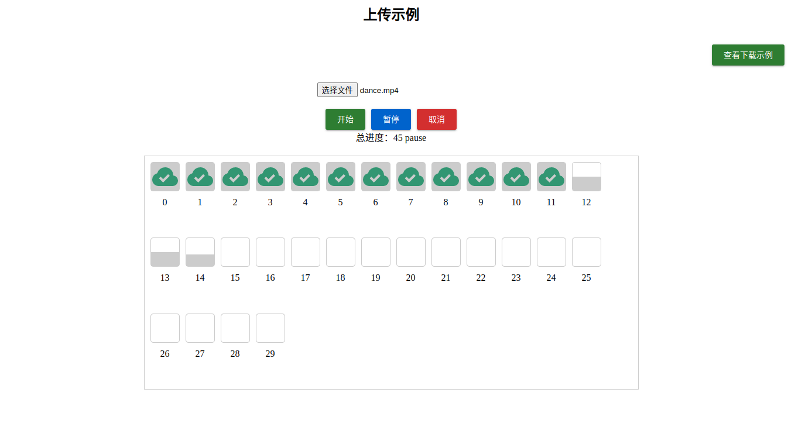

# slice-upload-utils

[](https://www.npmjs.com/package/slice-upload-utils)


<p align="center">
  
</p>

## 介绍

* 本工具包含上传和下载功能。vite + vue的实现。


  ### 上传

  - 包括切片上传，秒传，断点续传，暂停、取消。

  ### 下载

  - 切片下载，合并，暂停、取消。

  ### 上传hash计算

  - 为了优化计算hash时间，hash值计算分两种，一直是计算文件的真实MD5，一种是计算自定义hash值。

    ##### 自定义hash值：

     :: **preHash**，采用截取file前段和末段合成一个新的文件，同时结合文件的最后修改时间，和file.size一起计算的一个新的hash值。

    :: **chunkHash**，采用preHash结合chunkSize和该切片的index计算hash值。

    ##### 真实hash值：

    :: **preHash**, file文件的hash值，file的**真实**MD5值计算，在**file.size**大于**chunkSize**时，通过计算**chunk**的~~web worker~~线程里面同时计算。

    :: **chunkHash**, **file.size** 小于**chunkSize**时，**file**等于**chunk**，**chunkHash**等于**preHash**；**file.size**大于**chunkSize**时在~~web worker~~(vite 打包后，npm i 安装使用路径会出问题，故改成直接使用**promise**)里面计算。

  - 可以根据实例中的**isPreHash**和**isChunkHash**的值来判断当前是否计算的真实hash。


## 快速开始

 * 使用 pnpm 安装

  ```shell
pnpm add file-slice-upload
  ```

 ## 示例代码
### 上传
[/playground/vue/src/example/Upload.vue](./playground/vue/src/example/Upload.vue)
### 下载
[/playground/vue/src/example/Download.vue](./playground/vue/src/example/Download.vue)

### 下载文件后端代码
[koa-download-demo](https://github.com/ywenhao/koa-download-demo)

- 具体效果可以把代码仓库clone下来，pnpm dev一下。

## 调用说明

### 上传
```ts
export interface UseSliceUploadOptions {
  /**
   * 上传文件
   */
  file: Ref<File | null | undefined>
  /**
   * 上传请求函数
   */
  request: UploadRequest
  /**
   * 报错处理函数
   */
  onError?: UploadEventType['error']
  /**
   * 上传完成函数
   */
  onFinish?: UploadEventType['finish']
  /**
   * 预检函数
   */
  preVerifyRequest?: PreVerifyUploadRequest
  /**
   * 分片大小
   * @default 1024 * 1024 * 2
   */
  chunkSize?: number
  /**
   * 并发上传数
   * @default 3
   */
  poolCount?: number
  /**
   * 请求失败后，重试次数
   * @default 3
   */
  retryCount?: number
  /**
   * 请求失败后，重试间隔时间
   * @default 300
   */
  retryDelay?: number
  /**
   * 请求超时时间(15s)
   * @default 15000
   */
  timeout?: number
  /**
   * 计算整个文件的hash，开启后比较耗时间
   * @default false
   */
  realPreHash?: boolean
  /**
   * 计算分片文件的hash，开启后比较耗时间
   * @default false
   */
  realChunkHash?: boolean
}
```

### 下载
```ts
export interface UseSliceDownloadOptions {
  fileSize?: number
  filename?: string
  /**
   * 文件MIME类型
   * @default application/octet-stream
   * @see https://developer.mozilla.org/zh-CN/docs/Web/HTTP/Basics_of_HTTP/MIME_types/Common_types
   */
  fileType?: string
  /**
   * 是否自动保存
   * @default true
   */
  autoSave?: boolean
  /**
   * 分片大小
   * @default 1024 * 1024 * 2
   */
  chunkSize?: number
  /**
   * 并发上传数
   * @default 3
   */
  poolCount?: number
  /**
     * 请求失败后，重试次数
     * @default 3
     */
  retryCount?: number
  /**
     * 请求失败后，重试间隔时间
     * @default 300
     */
  retryDelay?: number
  /**
     * 请求超时时间(15s)
     * @default 15000
     */
  timeout?: number
  /**
   * 上传请求函数
   */
  request: DownloadRequest
  /**
   * 报错处理函数
   */
  onError?: DownloadEventType['error']
  /**
   * 预检函数
   */
  onFinish?: DownloadEventType['finish']
}
```

## License

[MIT](./LICENSE) License © 2023 [Ywenhao](https://github.com/ywenhao)