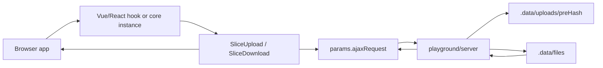
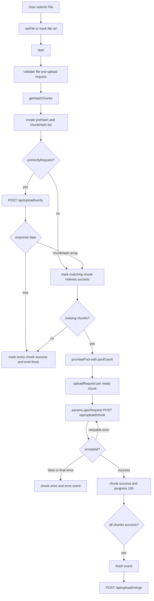
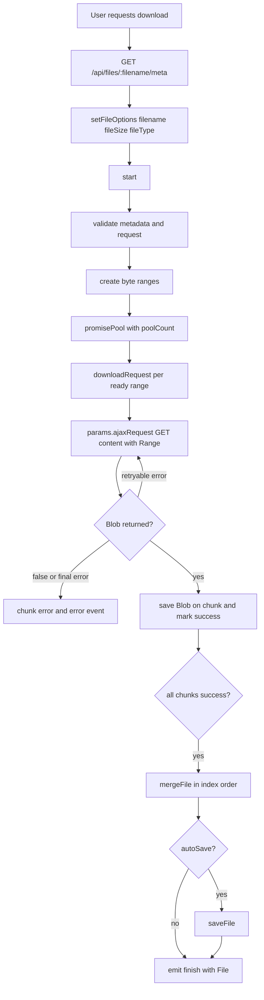

# Upload And Download Flow

This document records the end-to-end upload and download protocol used by the core library, the Vue playground, the local playground server, and the regression tests.

## Architecture

- `src/upload.ts` and `src/download.ts` contain the framework-neutral state machines.
- `src/vueHooks.ts` and `src/reactHooks.ts` only bind lifecycle, reactive state, and callbacks.
- `playground/server/src/server.ts` is the protocol reference backend. It is checked with TypeScript and run directly by Node 24's built-in type stripping in the playground scripts.
- `playground/vue/src/example/Upload.vue` and `Download.vue` call relative `/api/...` URLs through the Vite proxy.
- Tests cover core behavior in `test/core.test.ts`, request binding in `test/request-binding.test.ts`, and server integration in `test/playground-server.test.ts`.

## Upload Flow

### Upload Implementation Details

- `getHashChunks` creates a `preHash` and a chunk list. Small files use the source file as the single chunk.
- Default hash mode is sampled. `realPreHash` hashes the full file, and `realChunkHash` hashes each chunk.
- `preVerifyRequest` returns `true` for instant upload, or a `chunkHash[]` for resumable upload.
- Duplicate `chunkHash` values are handled by index matching. `getVerifiedChunkIndexes` consumes hash counts so identical chunk content does not mark too many chunks as uploaded.
- `params.ajaxRequest` is non-enumerable and bound with both `chunkIndex` and `chunkHash`. This avoids wrong chunk binding after awaits or concurrent uploads.
- XHR upload progress is capped at `99` until the request resolves. The chunk reaches `100` only after the upload request reports success.
- `pause()` and `cancel()` abort active XHRs. Delayed ajax calls and retry timers reject instead of hanging.
- When verify returns `true` or every chunk is already present, `finish` is emitted without a misleading `start` upload event.

### Upload Server Details

- `POST /api/upload/verify` reads existing `.part` files for `preHash`.
- `chunkTotal` is required and must be a positive integer, so verify and merge cannot fall back to a loose partial-file path.
- The server returns `true` only when indexes `0..chunkTotal-1` exist exactly once.
- Otherwise it returns resumable `chunkHash[]` for indexes that are safe to reuse.
- `POST /api/upload/chunk` validates `index`, `chunkTotal`, and `chunkSize`, then writes `{index}-{chunkHash}.part`.
- A retry for the same index replaces the old part file before writing the new one.
- `POST /api/upload/merge` refuses to merge missing or duplicate indexes. It merges in index order into `.data/files`.

## Download Flow

### Download Implementation Details

- `setFileOptions` resets existing chunks when `filename`, `fileSize`, or `fileType` changes.
- Ranges are inclusive HTTP byte ranges. The last chunk ends at `fileSize - 1`.
- `params.ajaxRequest` automatically adds `Range: bytes=start-end` and preserves custom `Headers`.
- XHR download progress is capped at `99` until the request resolves to a `Blob`.
- A chunk becomes `success` only after its `Blob` is stored. `emitFinish` merges only when every chunk has a real `Blob`.
- `mergeFile` constructs a `File` from chunks in index order. `saveFile` creates a temporary object URL and revokes it after clicking the anchor.

### Download Server Details

- `GET /api/files/:filename/meta` returns `filename`, `fileSize`, `fileType`, and the content URL.
- `GET /api/files/:filename/content` supports full responses, `HEAD`, and single `Range` headers.
- Valid ranges return `206` with `Content-Range`.
- Unsatisfiable or malformed ranges return `416` with `Content-Range: bytes */fileSize`.
- Suffix ranges such as `bytes=-1024` are supported.

## Failure And Resume Behavior

- Upload and download use `promisePool` with `poolCount`. The pool stops scheduling new work when pause or cancel is active.
- Failed chunks are marked `error`. Calling `start()` again resets error chunks to `ready` and retries only unfinished work.
- `retryCount` and `retryDelay` apply to ajax-backed chunk requests.
- `cancel()` resets chunk progress to `0`; `pause()` keeps progress so `start()` can resume unfinished chunks.
- Request functions should use the provided `params.ajaxRequest` helper instead of sharing a global instance request, because the helper is bound to the current chunk.

## Review Notes And Fixes

- Fixed download completion ordering so progress events cannot mark a chunk successful before the response `Blob` exists.
- Fixed instant-upload event ordering so `finish` is emitted without `start` when no chunk needs uploading.
- Hardened server verify and merge to require a complete, duplicate-free index sequence.
- Hardened chunk retry handling on the server by replacing stale parts for the same index.
- Added tests for instant upload event order, ajax download completion ordering, and retried chunk replacement.
